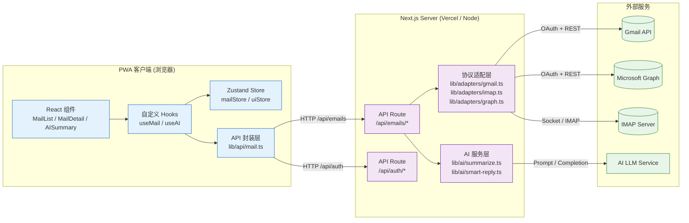

# AI Email Client — 架构设计文档

## 1. 项目概述

**AI-first 通用邮件客户端 PWA**，支持多协议邮件服务统一接入。用户通过单一界面管理来自不同提供商的邮件，AI 全程辅助阅读与回复。

### 支持的邮件服务

| 协议 | 提供商 | 接入方式 |
|------|--------|----------|
| REST API | Gmail | Google OAuth 2.0 |
| REST API | Office 365 (Outlook) | Microsoft OAuth 2.0 |
| REST API | Yahoo / AOL | IMAP-over-HTTP (第三方代理) |
| IMAP | 自定义 IMAP 服务器 | 服务端 IMAP 代理 |

### 明确排除的范围

> 本项目**仅聚焦邮件功能**。不包含日历、联系人管理、任务管理等模块。

---

## 2. 技术架构

### 2.1 数据流向



### 2.2 架构分层说明

| 层级 | 位置 | 职责 |
|------|------|------|
| **表现层** | `src/components/` | 纯 UI 组件，不直接调用 API，通过 Hooks 获取数据 |
| **逻辑层** | `src/hooks/`, `src/store/` | 业务逻辑编排、状态管理、缓存策略 |
| **API 封装层** | `src/lib/api/` | 前端请求封装，统一错误处理与重试机制 |
| **路由层** | `src/app/api/` | Next.js Serverless API Routes，鉴权、参数校验、协议分发 |
| **协议适配层** | `src/lib/adapters/` | 将不同邮件协议的响应转换为统一的 `UnifiedEmail` 模型 |
| **AI 服务层** | `src/lib/ai/` | AI 摘要、智能回复、邮件分类的 Prompt 编排与结果处理 |
| **外部服务** | Gmail API / Graph / IMAP / LLM | 第三方服务，不直接暴露给前端 |

---

## 3. 统一数据模型

不管底层邮件协议是什么，前端和 API 层统一使用以下接口。这是整个架构的核心契约。

```typescript
/** 统一邮件数据模型 — 前端拿到的唯一数据结构 */
export interface UnifiedEmail {
  /** 全局唯一标识 (UUID) */
  id: string;

  /** 发件人信息 */
  sender: {
    name?: string;
    email: string;
  };

  /** 收件人列表 */
  recipients: Array<{
    name?: string;
    email: string;
    type: "to" | "cc" | "bcc";
  }>;

  /** 邮件主题 */
  subject: string;

  /** 邮件正文 */
  body: {
    /** 纯文本版本 (默认展示) */
    plain: string;
    /** HTML 版本 (富文本渲染) */
    html?: string;
  };

  /** 时间戳 */
  timestamps: {
    /** 发送时间 (ISO 8601) */
    sent: string;
    /** 接收时间 (ISO 8601) */
    received: string;
  };

  /** 状态标记 */
  flags: {
    isRead: boolean;
    isStarred: boolean;
    isDraft: boolean;
    hasAttachments: boolean;
  };

  /** 附件列表 */
  attachments: Array<{
    id: string;
    filename: string;
    mimeType: string;
    size: number;
    downloadUrl: string;
    thumbnailUrl?: string;
  }>;

  /** 邮件线程 ID (用于会话视图) */
  threadId?: string;

  /** 来源标识 (用于调试和日志) */
  source: {
    /** 账户 ID */
    accountId: string;
    /** 协议类型 */
    protocol: "gmail" | "graph" | "imap";
    /** 原始协议 ID */
    rawId: string;
  };

  /** AI 生成的数据 (懒加载) */
  ai?: {
    /** 邮件摘要 */
    summary?: string;
    /** 关键要点 */
    keyPoints?: string[];
    /** 情感倾向 */
    sentiment?: "positive" | "neutral" | "negative";
    /** 是否需要回复 */
    requiresResponse?: boolean;
  };
}

/** 统一账户模型 */
export interface UnifiedAccount {
  id: string;
  name: string;
  email: string;
  protocol: "gmail" | "graph" | "imap";
  isConnected: boolean;
  lastSyncedAt: string | null;
  unreadCount: number;
}
```

### 3.1 协议适配规则

```
Gmail API 响应  ─┐
                 ├──> adapter.normalize() ──> UnifiedEmail
Graph API 响应  ─┘                           (统一格式)
IMAP 原始数据   ─┘
```

每个协议适配器 (`lib/adapters/gmail.ts`, `lib/adapters/graph.ts`, `lib/adapters/imap.ts`) 负责将各自协议的原始响应转换为 `UnifiedEmail`。

---

## 4. 核心功能模块设计

### 4.1 统一收件箱 (Unified Inbox)

- **目标**：将来自不同协议的邮件合并为单一时间线视图
- **策略**：服务端按 `timestamps.received` 排序后返回，前端虚拟列表渲染
- **分页**：游标分页 (`cursor-based pagination`)，每次加载 20 条
- **实时更新**：使用 Server-Sent Events (SSE) 推送新邮件通知
- **缓存**：SWR / React Query 管理请求缓存，避免重复请求

### 4.2 账户切换 (Account Switcher)

- **存储**：账户列表缓 Zustand store，OAuth token 通过 HttpOnly Cookie 存储
- **UI**：侧边栏顶部可展开的账户选择器，支持快速切换和"全部账户"聚合视图
- **认证**：Google OAuth 2.0 / Microsoft OAuth 2.0，token 自动刷新
- **IMAP 接入**：通过用户手动输入的 IMAP/SMTP 凭据存储在服务端加密 vault

### 4.3 AI 智能摘要 (AI Summary)

- **触发**：用户点击"AI 摘要"按钮时按需生成，非预生成（控制成本）
- **流程**：
  1. 前端请求 → `/api/ai/summarize` → 传入邮件 `id`
  2. 服务端通过 `UnifiedEmail.body.plain` 构建 Prompt
  3. 调用 LLM API，返回摘要 + 关键要点 + 情感分析
  4. 结果缓存 24 小时，相同邮件不重复调用
- **Prompt 策略**：系统 Prompt 固定为中文，要求输出 JSON 格式的结构化结果

### 4.4 智能回复草稿 (Smart Reply)

- **触发**：打开未读邮件时自动预加载 3 条候选回复
- **策略**：
  - 简短回复（确认/感谢/拒绝）→ 快速点击
  - 长回复草稿 → 点击后进入撰写编辑器
- **上下文**：Prompt 包含原始邮件正文 + 发件人 + 用户历史回复风格
- **安全**：AI 生成的回复默认在草稿中，用户确认后发送

### 4.5 PWA 离线支持

- **Service Worker**：next-pwa 配置，缓存关键路由和静态资源
- **离线队列**：撰写中的邮件存入 IndexedDB，恢复联网后自动发送
- **离线阅读**：最近 50 封邮件缓存到 IndexedDB，支持离线查看

---

## 5. 技术决策记录

| 决策 | 选择 | 理由 |
|------|------|------|
| 状态管理 | Zustand | 比 Redux 轻量，比 Context 高效，API 简单 |
| API 数据获取 | 原生 fetch + React Hooks | 不过度设计，后续可替换为 SWR/TanStack Query |
| 服务端部署 | Vercel (Serverless) | Next.js 原生支持，零运维 |
| AI 服务 | 独立 API 调用 (非本地模型) | 控制复杂度，后续可替换 Provider |
| PWA 离线 | IndexedDB + next-pwa | 标准方案，兼容性好 |
| 认证 | HttpOnly Cookie + OAuth 2.0 | 安全性高于 localStorage token |
