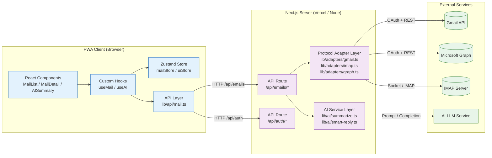

# AI Email Client — Architecture Design Document

## 1. Project Overview

**AI-first General Email Client PWA**, supporting unified access to multi-protocol email services. Users manage emails from different providers through a single interface, with AI assistance throughout reading and replying.

### Supported Email Services

| Protocol | Provider | Access Method |
|----------|----------|---------------|
| REST API | Gmail | Google OAuth 2.0 |
| REST API | Office 365 (Outlook) | Microsoft OAuth 2.0 |
| REST API | Yahoo / AOL | IMAP-over-HTTP (third-party proxy) |
| IMAP | Custom IMAP Server | Server-side IMAP Proxy |

### Explicitly Out of Scope

> This project **focuses solely on email functionality**. It does not include calendar, contact management, task management, or similar modules.

---

## 2. Technical Architecture

### 2.1 Data Flow



### 2.2 Architecture Layers

| Layer | Location | Responsibilities |
|-------|----------|------------------|
| **Presentation Layer** | `src/components/` | Pure UI components; do not call APIs directly, consume data via Hooks |
| **Logic Layer** | `src/hooks/`, `src/store/` | Business logic orchestration, state management, caching strategies |
| **API Wrapper Layer** | `src/lib/api/` | Frontend request encapsulation with unified error handling and retry mechanisms |
| **Routing Layer** | `src/app/api/` | Next.js Serverless API Routes: authentication, parameter validation, protocol dispatching |
| **Protocol Adapter Layer** | `src/lib/adapters/` | Translates responses from different email protocols into the unified `UnifiedEmail` model |
| **AI Service Layer** | `src/lib/ai/` | Prompt orchestration and result processing for AI summaries, smart replies, and email classification |
| **External Services** | Gmail API / Graph / IMAP / LLM | Third-party services; never exposed directly to the frontend |

---

## 3. Unified Data Model

Regardless of the underlying email protocol, the frontend and API layers use the following interfaces as the single source of truth. This is the core contract of the entire architecture.

```typescript
/** Unified email data model — the only data structure the frontend works with */
export interface UnifiedEmail {
  /** Globally unique identifier (UUID) */
  id: string;

  /** Sender information */
  sender: {
    name?: string;
    email: string;
  };

  /** Recipient list */
  recipients: Array<{
    name?: string;
    email: string;
    type: "to" | "cc" | "bcc";
  }>;

  /** Email subject */
  subject: string;

  /** Email body */
  body: {
    /** Plain text version (default display) */
    plain: string;
    /** HTML version (rich text rendering) */
    html?: string;
  };

  /** Timestamps */
  timestamps: {
    /** Sent time (ISO 8601) */
    sent: string;
    /** Received time (ISO 8601) */
    received: string;
  };

  /** Status flags */
  flags: {
    isRead: boolean;
    isStarred: boolean;
    isDraft: boolean;
    hasAttachments: boolean;
  };

  /** Attachment list */
  attachments: Array<{
    id: string;
    filename: string;
    mimeType: string;
    size: number;
    downloadUrl: string;
    thumbnailUrl?: string;
  }>;

  /** Thread ID (for conversation view) */
  threadId?: string;

  /** Source identifier (for debugging and logging) */
  source: {
    /** Account ID */
    accountId: string;
    /** Protocol type */
    protocol: "gmail" | "graph" | "imap";
    /** Original protocol-specific ID */
    rawId: string;
  };

  /** AI-generated data (lazy-loaded) */
  ai?: {
    /** Email summary */
    summary?: string;
    /** Key points */
    keyPoints?: string[];
    /** Sentiment */
    sentiment?: "positive" | "neutral" | "negative";
    /** Whether a reply is expected */
    requiresResponse?: boolean;
  };
}

/** Unified account model */
export interface UnifiedAccount {
  id: string;
  name: string;
  email: string;
  protocol: "gmail" | "graph" | "imap";
  isConnected: boolean;
  lastSyncedAt: string | null;
  unreadCount: number;
}
```

### 3.1 Protocol Adapter Rules

```
Gmail API response  ─┐
                      ├──> adapter.normalize() ──> UnifiedEmail
Graph API response  ─┘                            (unified format)
IMAP raw data       ─┘
```

Each protocol adapter (`lib/adapters/gmail.ts`, `lib/adapters/graph.ts`, `lib/adapters/imap.ts`) is responsible for converting raw responses from its respective protocol into `UnifiedEmail`.

---

## 4. Core Feature Module Design

### 4.1 Unified Inbox

- **Goal**: Merge emails from different protocols into a single timeline view
- **Strategy**: Server-side sorting by `timestamps.received`, frontend renders with virtualized list
- **Pagination**: Cursor-based pagination, loading 20 items per page
- **Real-time updates**: Server-Sent Events (SSE) for push notifications of new emails
- **Caching**: SWR / React Query for request caching to avoid duplicate requests

### 4.2 Account Switcher

- **Storage**: Account list cached in Zustand store; OAuth tokens stored in HttpOnly cookies
- **UI**: Expandable account selector at the top of the sidebar, supporting quick switching and an "All Accounts" aggregated view
- **Authentication**: Google OAuth 2.0 / Microsoft OAuth 2.0 with automatic token refresh
- **IMAP Integration**: IMAP/SMTP credentials entered manually by the user are stored in a server-side encrypted vault

### 4.3 AI Summary

- **Trigger**: Generated on demand when the user clicks the "AI Summary" button; not pre-generated (to control costs)
- **Flow**:
  1. Frontend request → `/api/ai/summarize` → passes the email `id`
  2. Server builds the prompt from `UnifiedEmail.body.plain`
  3. Calls the LLM API, returns summary + key points + sentiment analysis
  4. Results are cached for 24 hours; the same email is not processed repeatedly
- **Prompt Strategy**: System prompt outputs structured JSON results

### 4.4 Smart Reply Drafts

- **Trigger**: Automatically preloads 3 candidate replies when an unread email is opened
- **Strategy**:
  - Short replies (confirm / thank / decline) → quick-click buttons
  - Long reply drafts → opens the compose editor on click
- **Context**: Prompt includes the original email body, sender, and the user's historical reply style
- **Safety**: AI-generated replies are placed in draft by default; the user must confirm before sending

### 4.5 PWA Offline Support

- **Service Worker**: Configured via next-pwa to cache critical routes and static assets
- **Offline Queue**: Composed emails are stored in IndexedDB and sent automatically when connectivity is restored
- **Offline Reading**: The latest 50 emails are cached in IndexedDB for offline viewing

---

## 5. Technical Decision Records

| Decision | Choice | Rationale |
|----------|--------|-----------|
| State Management | Zustand | Lighter than Redux, more efficient than Context, simpler API |
| API Data Fetching | Native fetch + React Hooks | Avoids over-engineering; can be swapped for SWR/TanStack Query later |
| Server Deployment | Vercel (Serverless) | Native Next.js support, zero ops overhead |
| AI Service | Independent API calls (not local models) | Reduces complexity; provider can be swapped later |
| PWA Offline | IndexedDB + next-pwa | Standard solution with good compatibility |
| Authentication | HttpOnly Cookie + OAuth 2.0 | More secure than localStorage tokens |
